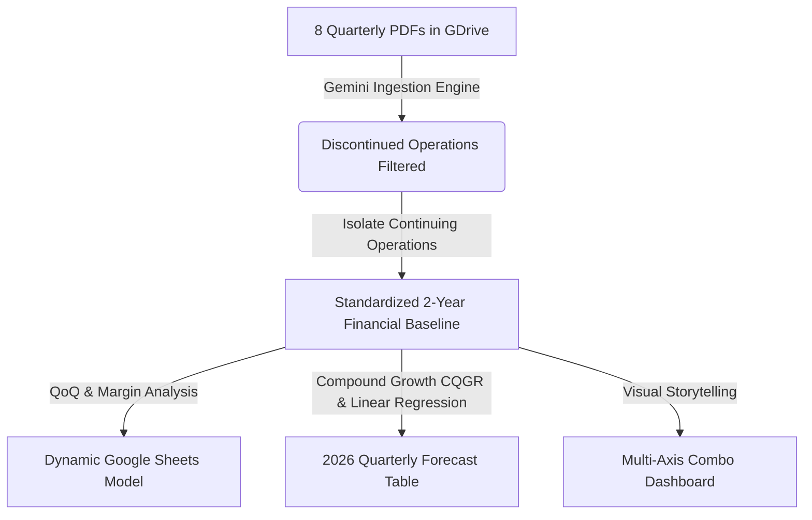

# Generative AI in Corporate Finance: FP&A Lab & Case Study Suite
## AI-Powered Financial Data Ingestion, Normalization, Trend Analysis, and Contract Intelligence

Welcome to the **Generative AI in Corporate Finance Lab Suite**. This repository contains a structured, hands-on curriculum, prompt library, and case study resources designed to teach corporate finance professionals, FP&A (Financial Planning & Analysis) analysts, and students how to leverage advanced Generative AI (such as Google Gemini) to automate and elevate critical accounting, forecasting, and contract analysis workflows.

The entire suite is grounded in a highly realistic corporate scenario involving **GFL Environmental Inc. (NYSE: GFL)**, a multi-billion dollar environmental services giant, during a period of massive structural transition.

---

## 🗺️ Repository Structure

This repository is organized into four distinct use cases (`uc`), each targeting a specific core competency in modern, AI-integrated financial operations:

```text
finance/
├── uc1_summarizing_financial_reports/             # Quarterly Reporting & Quick Summaries
│   ├── Financial_Statement_GFL-Environmental-Inc_Q1-2026_FS.pdf
│   ├── prompt.md                                  # Prompt for Forensic Financial Summary
│   └── usecase_desc.md                            # Usecase objectives and instructions
│
├── uc2_analyzing_financial_data_trends_sheets/    # Google Sheets Ingestion & Predictive Modeling
│   ├── 2024-Q1-FS.pdf to 2025-Q4-FS.pdf           # 8 Quarters of Financial Statements
│   ├── AI_Google_Sheets_Lab_Guide.md              # Complete student manual & activity guide
│   ├── lab_guide.md                               # Operational live demo workflow steps
│   └── prompts.md                                 # Prompt templates for Google Sheets
│
├── uc4_creating_presentations_outlines/           # Corporate Presentation & Slides Outlining
│   └── promtps.md                                 # Prompts for executive decks (GFL branding)
│
└── uc6_pdf_lease_agreement_scanner/               # Contract Intelligence & Lease Provision Extraction
    ├── prompt.md                                  # Prompt for nested Excel-importable table
    └── usecase_desc.md                            # Extraction fields and criteria
```

---

## 📊 Strategic Case Study: The GFL Environmental Divestiture

The analytical backbone of these labs is the major corporate event GFL Environmental underwent in early 2025: **the divestiture of its massive Environmental Services line for $8.0 billion in cash**. 

This event creates a classic corporate FP&A nightmare:
* **The Problem:** Historical reports from 2024 include revenues and expenses from the divested segment. The 2025 reports separate these out as "discontinued operations." A simple copy-paste of "Total Revenue" figures results in a highly distorted and financially meaningless 2-year trend line.
* **The Solution:** Students instruct Gemini to act as a **smart accounting engine** to automatically read across 8 quarterly PDFs, ignore discontinued operations, and extract metrics strictly from **Continuing Operations** to build an accurate, standardized, "apple-to-apple" 2-year baseline.



---

## 🛠️ Detailed Use Cases & Walkthroughs

### 📑 UC1: Summarizing Financial Reports
* **Role:** Forensic Financial Analyst
* **Goal:** Extract and summarize quarterly financial data from GFL's Q1 2026 financial report with absolute numerical accuracy.
* **Core Task:** Read the Q1 2026 PDF to extract and calculate Revenue, Adjusted EBITDA, Net Income/Loss, Adjusted Free Cash Flow, Margins, and YoY Growth percentages.
* **Output Format:** Clean Markdown table optimized for MS Excel importing, formatted using negative accounting brackets `( )` and standard corporate shorthand (dollar values in millions with 'M').

---

### 📈 UC2: Google Sheets Lab — Data Trends & Forecasting
* **Role:** Corporate FP&A Lead
* **Goal:** Execute a zero-data-entry financial model, calculate historical baseline growth, and project upcoming quarters.
* **Step-by-Step Lab Activities:**
  1. **AI-Driven Ingestion & Normalization:** Connect Gemini in Google Sheets directly to the 8 quarterly PDF files in Google Drive. Execute a master prompt to extract Revenue, Cost of Sales, SG&A, and Adjusted EBITDA strictly from **Continuing Operations**.
  2. **Trend Analytics:** Use Gemini to append formulas calculating Quarter-over-Quarter (QoQ) Revenue Growth and Adjusted EBITDA Margins (revealing GFL's operational margin expansion from 26.15% in Q1 2024 to 31.58% in Q3 2025 as a result of its solid waste efficiency).
  3. **Instant Dashboarding:** Generate a multi-axis combo chart (Revenue as vertical bars, Adjusted EBITDA Margin as a line trend) and organize sheets into separate `Analysis` and `Dashboard` tabs.
  4. **Predictive Modeling (2026 Forecast):** Calculate the Compound Quarterly Growth Rate (CQGR) based on the 8-quarter continuing operations baseline (~2.36% per quarter) and project Q1–Q4 2026 Revenue and Cost of Sales using both compounding growth and linear statistical trend formulas (`TREND`).

---

### 🎨 UC4: Creating Presentation Outlines
* **Role:** Executive Communications Designer
* **Goal:** Generate highly professional slide outlines based on GFL's financial data.
* **Core Requirements:**
  * Define an impactful cover slide using GFL's brand colors: White and Vibrant Green (`#97D60E`).
  * Structured highlights comparing aggregated 2024 vs. 2025 performance, placing 2024 numbers on the left and 2025 on the right.
  * 2026 projections outlines with Revenue positioned on the right and Cost of Sales on the left, demonstrating visual balance.

---

### 🔍 UC6: PDF Lease Agreement Scanner & Extractor
* **Role:** AI Contract Extraction Specialist
* **Goal:** Transform complex legal lease agreements into structured corporate database schemas.
* **Core Task:** Analyze lease PDFs to extract Commencement Date, Term Length, Property Details, Base Rental Payments, Variable Increases (e.g., CPI escalations), Renewal Options, Purchase/Buyout options, and Execution Status.
* **Output Format:** Validated Markdown table mapped to a target Excel schema with a hierarchical layout (using the `↳` arrow symbol for indented rows) and explicit page/section citations for compliance auditing.

---

## 🎛️ Copy-Paste Prompt Command Center

### Ingestion & Normalization Prompt (UC2)
> *"Review the following 8 files in my Google Drive: '2024-Q1-FS.pdf', '2024-Q2-FS.pdf', '2024-Q3-FS.pdf', '2024-Q4-FS.pdf', '2025-Q1-FS.pdf', '2025-Q2-FS.pdf', '2025-Q3-FS.pdf', and '2025-Q4-FS.pdf'. Extract the Revenue, Cost of Sales, SG&A, and Adjusted EBITDA for each quarter. Because the Environmental Services segment was divested in 2025, extract data strictly from Continuing Operations so our 2-year trend is standardized. Organize this into a horizontal table with quarters as columns."*

### Historical Trend Analytics Prompt (UC2)
> *"Based on the sheet data, calculate the Quarter-over-Quarter (QoQ) Revenue growth rate from Q2 2024 to Q4 2025. Also, calculate the Adjusted EBITDA margin for each quarter. Tell me what formulas to use or append them to the table."*

### Predictive 2026 Forecasting Prompt (UC2)
> *"Based on the 8-quarter financial model in our sheet (where continuing operations revenue scaled from $1,431.8 million in Q1 2024 to $1,686.4 million in Q4 2025), calculate the Compound Quarterly Growth Rate (CQGR) for revenue. Then, create a projection table for the upcoming quarters of 2026 (Q1 2026 through Q4 2026). Assume Cost of Sales maintains its historical average percentage of revenue, and provide the exact Google Sheets formulas needed to make this dynamic."*

---

## 📐 Mathematical Baselines & Key Formulas

For verification and educational accuracy, the key financial formulas taught across these labs include:

### 1. Compound Quarterly Growth Rate (CQGR)
$$CQGR = \left( \frac{\text{Ending Value}}{\text{Beginning Value}} \right)^{\frac{1}{n}} - 1$$
*Where:*
* $\text{Beginning Value (Q1 2024 Revenue)} = \$1,431.8\text{M}$
* $\text{Ending Value (Q4 2025 Revenue)} = \$1,686.4\text{M}$
* $n = 7\text{ growth periods}$
* **Result:** $CQGR \approx 2.36\%$ per quarter.

### 2. Google Sheets Formula Implementations
* **Compounded Projected Revenue (Q1 2026 - Cell J2):**
  ```excel
  =I2 * (1 + 0.0236)
  ```
* **Linear Statistical Regression (Cell J2 Alternate):**
  ```excel
  =TREND(B2:I2, B1:I1, J1)
  ```
* **Cost of Sales Projections (Cell J3 - Dynamic Average Run-Rate):**
  ```excel
  =J2 * AVERAGE(INDEX(B3:I3 / B2:I2))
  ```

---

## 🚀 Getting Started

1. **Verify Access:** Ensure your Google Workspace account has Gemini enabled.
2. **Setup Drive Folder:** Create a folder in Google Drive (e.g., `GFL Labs`) and upload the quarterly financial statement PDF documents.
3. **Open Google Sheets:** Launch a blank Google Sheet, open the Gemini panel on the right, and start pasting the prompts from the [Prompt Command Center](#-copy-paste-prompt-command-center) or following the detailed steps in [AI_Google_Sheets_Lab_Guide.md](./uc2_analyzing_financial_data_trends_sheets/AI_Google_Sheets_Lab_Guide.md).

---
*Disclaimer: This repository is for educational and laboratory demonstration purposes. All figures and events are modeled after publicly available GFL Environmental Inc. financial disclosures.*
